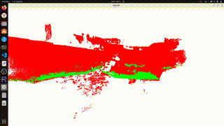

# Intel-RealSense-D455-Surface-Detection-Project



## 🧭 Overview

The system performs the following steps:

1. **Capture RGB-D and IMU data** from the Intel RealSense D455 camera.  
2. **Fuse visual and inertial data** using the Madgwick filter for robust odometry.  
3. **Generate a 3D map** in **RTAB-Map** and export it as a `.db` or `.ply` file.  
4. **Process the saved map** in Python with **Open3D** to detect and visualize the floor surface.

---

## ⚙️ System Requirements

- Ubuntu 22.04 (recommended)
- ROS 2 Humble
- Intel RealSense D455
- Python 3.10+
- Open3D ≥ 0.18
- RTAB-Map ≥ 0.20

---

## 🧩 Installation

### 1. Install ROS 2 and dependencies

Install required ROS 2 packages:

```bash
sudo apt install ros-humble-realsense2-camera ros-humble-rtabmap-ros \
                 ros-humble-imu-filter-madgwick python3-pip
```
### 2. Install Python dependencies
```bash
pip install "numpy<2.0" open3d --break-system-packages
```
---
## 📷 Launching the RealSense D455

Start the Intel RealSense D455 camera with RGB-D and IMU data streams:

```bash
ros2 launch realsense2_camera rs_launch.py \
  color_width:=640 color_height:=480 \
  depth_width:=640 depth_height:=480 depth_fps:=30 depth_max:=2.0 \
  enable_gyro:=true enable_accel:=true unite_imu_method:=1 \
  pointcloud.enable:=true align_depth.enable:=true
```

| Parameter                              | Description                                                                                                           |
| -------------------------------------- | --------------------------------------------------------------------------------------------------------------------- |
| `color_width:=640 color_height:=480`   | Sets the resolution of the RGB (color) stream to **640×480** pixels.                                                  |
| `depth_width:=640 depth_height:=480`   | Sets the resolution of the depth stream to **640×480** — must match color resolution for alignment.                   |
| `depth_fps:=30`                        | Frame rate of the depth stream (**30 FPS**) for real-time operation.                                                  |
| `depth_max:=2.0`                       | Maximum valid depth distance (in meters). Points farther than **2 m** are ignored.                                    |
| `enable_gyro:=true enable_accel:=true` | Enables the **gyroscope** and **accelerometer** sensors in the D455.                                                  |
| `unite_imu_method:=1`                  | Fuses accelerometer and gyroscope data into a single IMU topic `/imu/data`. Method `1` uses **linear interpolation**. |
| `pointcloud.enable:=true`              | Publishes a **3D point cloud** generated from the depth image.                                                        |
| `align_depth.enable:=true`             | Aligns the depth image to the color frame — ensures both have the same pixel correspondence.                          |


This launch configuration provides:

- Aligned RGB-D streams (ready for SLAM or mapping)

- IMU fusion (accelerometer + gyroscope)

- 3D point cloud publishing for visualization or mapping (e.g. RTAB-Map, RViz)
---
## 🧮 IMU Fusion

Run the Madgwick filter to fuse raw IMU data (gyroscope + accelerometer) from the RealSense D455 and output orientation in quaternion form:

```bash
ros2 run imu_filter_madgwick imu_filter_madgwick_node \
  --ros-args \
  -r imu/data_raw:=/camera/camera/imu \
  -p use_mag:=false \
  -p publish_tf:=true \
  -p frame_id:=camera_link \
  -p fixed_frame:=camera_link
```

| Parameter                             | Description                                                                                                               |
| ------------------------------------- | ------------------------------------------------------------------------------------------------------------------------- |
| `-r imu/data_raw:=/camera/camera/imu` | Remaps the raw IMU topic from the RealSense camera to the input expected by the Madgwick filter.                          |
| `-p use_mag:=false`                   | Disables the magnetometer (the D455 doesn’t provide magnetometer data). The filter will rely only on gyro and accel data. |
| `-p publish_tf:=true`                 | Publishes a **TF transform** representing the orientation of the IMU in the ROS TF tree.                                  |
| `-p frame_id:=camera_link`            | Sets the IMU frame name to `camera_link` — this ensures consistency with RTAB-Map’s expected reference frame.             |
| `-p fixed_frame:=camera_link`         | Defines a fixed reference frame for orientation output (used when publishing TF).                                         |

Result:

This node:

- Subscribes to /camera/camera/imu (raw IMU data)

- Publishes filtered orientation as /imu/data

- Adds an orientation TF between camera_link and odom

- Provides fused inertial data that improves pose estimation in RTAB-Map for visual-inertial SLAM
---
## 🗺️ Building the Map with RTAB-Map

Launch RTAB-Map (visual + depth + IMU SLAM):

```bash
ros2 launch rtabmap_launch rtabmap.launch.py \
  rgb_topic:=/camera/camera/color/image_raw \
  depth_topic:=/camera/camera/depth/image_rect_raw \
  camera_info_topic:=/camera/camera/color/camera_info \
  frame_id:=camera_link \
  use_sim_time:=false \
  imu_topic:=/imu/data \
  approx_sync:=true
```

### Explanation of parameters

| Parameter           | Description                                                                                                                                                                              |
| ------------------- | ---------------------------------------------------------------------------------------------------------------------------------------------------------------------------------------- |
| `rgb_topic`         | Topic with the raw color images (RGB). RTAB-Map uses these images for feature detection and loop closure.                                                                                |
| `depth_topic`       | Topic with depth images (rectified). Used together with RGB for RGB-D odometry and mapping.                                                                                              |
| `camera_info_topic` | Camera intrinsics (focal length, principal point). Required for correct depth-to-3D projection.                                                                                          |
| `frame_id`          | The TF frame that identifies the camera base (e.g. `camera_link`). All poses published by RTAB-Map are expressed relative to this frame.                                                 |
| `use_sim_time`      | If `true`, the node uses ROS simulated time (`/clock`). For a live camera set `false`.                                                                                                   |
| `imu_topic`         | Topic with fused IMU data (orientation + accel + gyro), e.g. `/imu/data`. RTAB-Map can use IMU to improve odometry.                                                                      |
| `approx_sync`       | When `true` RTAB-Map will accept approximately synchronized RGB/depth/IMU messages (tolerant to timestamp jitter). When `false`, RTAB-Map expects exact timestamps (faster but fragile). |

---

## 🧠 Processing the Map with Open3D (Planar Surface Segmentation using RANSAC)

After you have exported your scanned room as a .ply file from RTAB-Map, you can use Open3D to process the point cloud and detect planar surfaces such as the floor. Below is an explanation of the workflow and example code.

```python
import open3d as o3d
import numpy as np

cloud = o3d.io.read_point_cloud("map.ply")
cloud = cloud.voxel_down_sample(voxel_size=0.02)
plane_model, inliers = cloud.segment_plane(distance_threshold=0.02, ransac_n=3, num_iterations=1000)
plane_cloud = cloud.select_by_index(inliers)
rest_cloud = cloud.select_by_index(inliers, invert=True)
plane_cloud.paint_uniform_color([0, 1, 0])
rest_cloud.paint_uniform_color([1, 0, 0])
o3d.visualization.draw_geometries([plane_cloud, rest_cloud])
```
### Explanation:

- This code loads your .ply point cloud from RTAB-Map.

- It downsamples the points to reduce noise and speed up processing.

- It detects the largest planar surface (usually the floor) using RANSAC.

- The plane points are colored green, and the rest (walls, furniture) red.

- Finally, it visualizes the segmented scene in an interactive 3D viewer.
---
### Important operational notes & checks

* **Topic names & QoS**: make sure the topics you pass exist. Use:

  ```bash
  ros2 topic list
  ros2 topic echo /camera/camera/color/image_raw --qos-profile sensor_data
  ros2 topic hz /camera/camera/depth/image_rect_raw --qos-profile sensor_data
  ```

  If topics are published with incompatible QoS, subscribers may not receive messages (RealSense warns about "incompatible QoS").

* **Frame consistency**: `frame_id` must match the TF frames published by your camera/IMU pipeline. Typical frames: `camera_link`, `camera_color_optical_frame`, `camera_imu_optical_frame`, `odom`, `map`. RTAB-Map expects a valid TF chain so it can publish `map -> odom -> base_link` transforms.

* **IMU data**:

  * RTAB-Map expects IMU messages (if used) to *contain orientation* (quaternion). If you use `imu_filter_madgwick`, ensure it publishes `/imu/data` **before** or **while** starting RTAB-Map.
  * Verify IMU message content:

    ```bash
    ros2 topic echo /imu/data -n 1
    ```

    Check `orientation` not all zeros and `frame_id` consistent.

* **Timestamps & sync**:

  * `approx_sync:=true` helps when message timestamps are not exactly aligned.
---

### Saving / exporting the map

* **Save DB (GUI)**: Open RTAB-Map GUI → `File` → `Save database as` → `my_map.db`
* **Export point cloud (GUI)**: `File` → `Export` → `Point cloud` → `map_raw.ply`
---

### Useful `ros2 param` tweaks (runtime tuning)

You can change RTAB-Map and rgbd_odometry parameters at runtime with `ros2 param set` (use the exact node name from `ros2 node list`):

* Enable approximate sync and set tolerance:

  ```bash
  ros2 param set /rtabmap/rgbd_odometry approx_sync true
  ros2 param set /rtabmap/rgbd_odometry approx_sync_max_interval 0.02
  ```

* Check current parameters:

  ```bash
  ros2 param list /rtabmap/rtabmap
  ros2 param get /rtabmap/rtabmap Mem/IncrementalMemory
  ```

---

### Performance & quality tips

* **Image size**: reduce RGB/depth to 640×480 or 480×360 for higher speed;

---

### Quick diagnostics checklist (if RTAB-Map not mapping)

1. `ros2 topic list` — are RGB, depth, camera_info, and /imu/data present?
2. `ros2 topic hz /camera/camera/color/image_raw --qos-profile sensor_data` — is the RGB stream publishing?
3. `ros2 topic echo /imu/data -n 1` — does IMU contain `orientation`?
4. `ros2 node list` — is `/rtabmap/rtabmap` and `/rtabmap/rgbd_odometry` running?
5. `ros2 param get /rtabmap/rtabmap frame_id` — does it equal your camera `frame_id`?
6. Visual check: open `rtabmap-viz` and monitor topics/messages and the "Console" tab for warnings.
